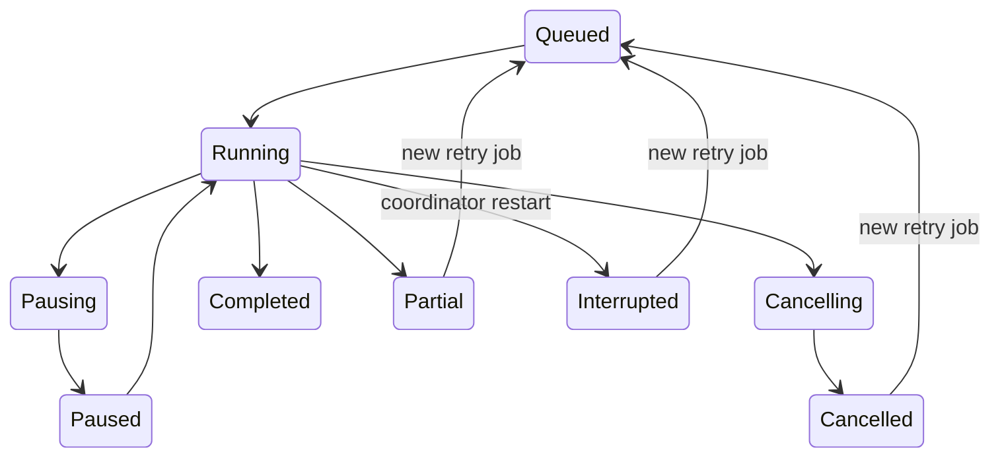

# Jobs and compression

The GUI and ordinary CLI compression/decompression commands send versioned
JSON requests to a per-user coordinator. The coordinator owns a single active
worker and a durable SQLite queue. Closing a client leaves the worker running.
Advanced CLI overrides use the same filesystem-operation lock.

Analysis has its own `Analyzing` phase. Requested compression takes priority
over queued analysis and cancels an active analysis at its next checkpoint.
Each rewrite ioctl covers at most 16 MiB. In-flight ranges finish before
workers pause or stop; a partly rewritten file has no success receipt.
Launcher scans and process detection are periodic, so pause is not instantaneous.

## Ownership and recovery

- The local socket and queue live in an owner-only state directory. A held
  process lock prevents two coordinators from owning it. Messages have an
  8 MiB limit, deadlines, and a protocol version.
- One worker process handles one game. It applies Landlock before starting
  threads. Anchored `openat2` calls refuse symlinks and escapes from the game.
- A successful file emits a receipt immediately. Receipts store its exact
  path bytes, inode, size, timestamps, compression policy, and applied level.
  UTF-8 paths remain strings in IPC; other paths use byte arrays.
- A retry skips matching receipts. Changed fingerprints remain eligible.
  Changing operation or preset invalidates incompatible receipts before work,
  since btrfs rewrites leave timestamps unchanged. Starting decompression also
  invalidates CLI compression fingerprints; interruption cannot revive them.
  Partial database records preserve earlier successes and leave untouched
  files marked as not attempted. Startup marks unfinished running work as
  interrupted; queued work remains queued.
- Maintenance observations survive restart. Enabling a library establishes
  a baseline; subsequent new installs and settled updates enqueue work.
  A managed desktop startup entry exists while any library opts in.

## Decisions and evidence

The inventory applies the backend's minimum file size. Bounded header inspection
recognizes raw and block-compressed DDS and WAVE data, ZIP entry hints, common
engine archives, GPU textures, sound banks, and encoded media streams. Hints
control sample effort. Containers such as KTX, PVR, FSB, and XACT can carry raw
or encoded payloads, so they keep the full distributed sample. Unknown data,
encrypted ZIP entries, and familiar extensions still reach compression trials.
Parsers never unpack archives or alter their internal format.

Distributed samples include the first and last blocks. Native Maximum compares
levels 9 and 15 per file. Maximum Space compares levels 9, 15, 19, and 22 per
unique chunk and keeps the smallest representation. Update compaction uses the
same level search, so maintaining a store does not silently lower its compression
policy. Workers verify file identity before and after processing. Native btrfs
rewrites flush dirty pages first so new writes have extents to process.

Three different quantities must stay separate:

| Quantity | Meaning |
|---|---|
| Potential saving | A prediction from sampled blocks, limited by coverage |
| FIEMAP coverage | Logical bytes mapped to compressed extents, not their physical size |
| Drive free-space change | Whole-filesystem change, including other writers and snapshots |

Desktop analysis samples the largest files first, up to 32 MiB total and
1 MiB per file. Unsampled eligible files still reach the native pass. A
sampled file with a pack-only gain does not trigger a native rewrite. The
one-click choice requires at least 16 MiB and 5% projected saving; Maximum
Space also needs a game-specific compatibility result. Completed compression
consumes the earlier potential estimate.

`flummox benchmark` compares identical source samples using native-sized block
models and larger frames. `flummox pack benchmark` builds and verifies a full
store, including index and allocation overhead. Neither synthetic timing nor a
proxy establishes a Game Compressor advantage without a same-game native
WOF/LZX measurement.

## Current boundaries

Native writes support Linux btrfs and Windows WOF/LZX. The
[pack store](pack-store.md) adds verified larger chunks, within-store and
cross-game sharing, restoration, and FUSE mounts with persistent copy-on-write
data. Windows background maintenance and pack mounting, Bottles discovery,
and opt-in community data remain separate implementation work. Heroic and
Lutris adapters depend on their installed metadata; missing or malformed
sources produce warnings. The GUI's custom-folder control accepts a path;
a native folder dialog is still pending.

`just ci` checks code, tests, dependency policy, and prose. The IPC tests use
temporary homes and games. The native lifecycle test checks compression,
unchanged retries, updates, and byte preservation on btrfs. Tests that require
btrfs announce a skip on other filesystems.
